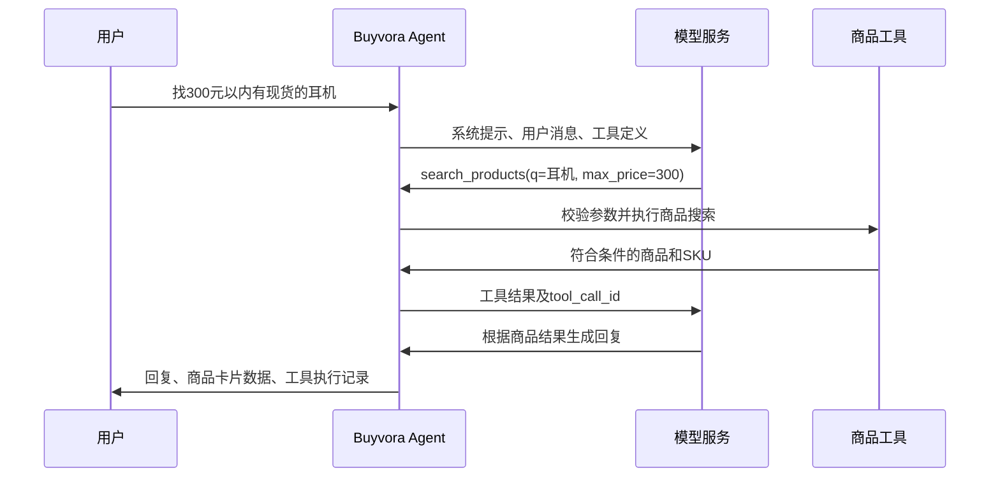

# 第 3 课：模型如何调用你的商品搜索

本阶段把固定回复替换为可配置的真实模型适配器，加入搜索、商品详情工具和多轮会话。

**验证边界**：本地已通过自动化测试，以及独立服务进程间的两轮 HTTP 协议验证。协议测试使用脚本模拟模型决策，不代表真实模型理解能力。真实模型联调仍需配置你选择的平台和模型后运行 `--live`。

## 一轮购物需求经过什么



模型只提出工具调用请求；真正执行的是你写的 Python 函数。这个过程可以重复多次，直到得到最终回复或达到限制。[官方工具调用说明](https://developers.openai.com/api/docs/guides/function-calling)

## 组件地图

| 文件 | 负责什么 | 学习重点 |
| --- | --- | --- |
| `app/settings.py` | 从环境变量和 .env 读取配置 | 配置和业务代码分离，密钥不入库 |
| `app/agent/model.py` | 请求兼容 Chat Completions 的服务 | HTTP、异步 I/O、接口适配与异常处理 |
| `app/agent/tools.py` | 注册两个只读工具并校验参数 | JSON Schema、白名单、复用业务服务 |
| `app/agent/shopping.py` | 执行模型→工具→模型循环 | Agent 调度与调用预算 |
| `app/agent/sessions.py` | 保存最近完整对话轮次 | 会话隔离、过期、并发与失败回滚 |
| `app/services/chat_service.py` | 把模型、工具、仓储组装起来 | 依赖注入 |
| `app/main.py` | 提供 HTTP 接口与统一错误响应 | 应用工厂与 API 层 |

我们先直接实现这个小循环，方便你理解 Agent 框架内部做了什么。模型端口 `ChatModel` 和商品仓储端口一样，是一份约定，后续更换适配器不会要求重写商品业务。

## 配置模型

在 PowerShell 中：

```powershell
Copy-Item .env.example .env
```

如果已有 `.env`，直接编辑已有文件。填入你自己的平台提供的配置：

```dotenv
LLM_BASE_URL=https://your-provider.example/v1
LLM_MODEL=your-model-id
LLM_API_KEY=your-key
```

以上是格式示例，不是可直接使用的服务。基础地址指向 API 根路径，程序会追加 `/chat/completions`。请选择支持 function calling 的模型。远程地址要求 HTTPS；本机 `localhost`、`127.0.0.1`、`::1` 可以使用 HTTP，本机服务无需鉴权时允许空 Key。

本项目默认不选择任何服务商。环境变量优先于 `.env`；修改配置后需要重启服务。不要把 Key 发到聊天里，也不要提交 `.env`。

```powershell
uv sync --locked
uv run uvicorn app.main:app --reload
```

打开 http://127.0.0.1:8000/ready：`model_configured` 仅表示配置齐全，**不表示服务已经连接成功**。商品接口和健康检查不需要模型 Key。

## 发起和继续对话

打开 http://127.0.0.1:8000/docs，在 `POST /commerce/chat` 输入：

```json
{"message": "找300元以内有现货的耳机，帮我比较一下"}
```

第一次不传 `session_id`，服务会生成一个随机 ID。响应包含：

- `reply`：模型生成的文字。
- `products`：最后一次商品搜索返回的结构化候选，直接来自商品工具。
- `tool_calls`：实际工具名、已校验参数、结果和成功状态；不展示模型内部推理。
- `catalog_source`：`demo`，表示数据来自虚构演示目录。

下一条请求复制上次返回的 ID：

```json
{"message": "预算改成200元以内，重新找一下", "session_id": "替换为刚返回的ID"}
```

当前会话只保存在单个服务进程的内存中，默认 30 分钟无活动过期，最多 128 个会话。重启服务会丢失会话，因此这一阶段仅用单进程运行。未知或过期 ID 返回 404，客户端应重新开始。

随机会话 ID 目前起到访问凭据的作用，拿到 ID 就能继续该会话；这不是账号鉴权，不能将当前版本直接作为多用户公开服务。账号与订单权限会在后续阶段完成。

## 为什么有这些边界

- 工具参数即使来自模型，也必须经过 Pydantic 校验。未知工具不会执行；本阶段没有下单和支付工具。
- 每轮最多 5 次模型调用、8 次工具调用；每次模型请求默认最长 30 秒。
- 工具最多返回 10 个商品，模型响应最多 1 MB；上下文按字符数限制为约 60000，不是精确 token 计数。
- 历史保留最近 6 个完整轮次，过长时删除最旧完整轮次，不拆散工具请求和结果。当前没有摘要记忆。
- 同一会话重复并发请求返回 409。失败或取消的半轮对话不写进历史，避免下一次请求接着错误状态运行。
- 商品卡片由工具结果构建；模型文字仍可能出现错误，需要真实模型评测，不能把提示词当作绝对正确性保证。

## 常见响应

| 状态 | 常见原因 | 怎么处理 |
| --- | --- | --- |
| 422 | 输入或字段不合法 | 检查请求格式 |
| 404 | 会话未知或过期 | 不传 session_id 开始新对话 |
| 409 | 本会话仍在处理上一条消息 | 等它结束再发送 |
| 503 | 未配置模型、Key 无效、模型限流或会话容量满 | 查看 detail.code，检查配置或稍后重试 |
| 502 | 上游失败、响应格式错误或调用预算耗尽 | 检查服务兼容性，或缩小问题范围 |
| 504 | 模型或整个请求超时 | 稍后重试 |

错误响应只给出本项目定义的错误码和提示，不把服务商原始错误、Key 或响应正文返回给用户。

## 怎样证明它能工作

```powershell
uv run pytest -q
uv run python scripts/smoke_agent.py
```

第二条会启动真实的 Buyvora HTTP 服务和一个本地协议测试服务，执行两轮对话并自动停止进程，不需要 Key、不消耗模型额度。成功输出中 `mode` 是 `scripted-protocol-fixture`。

完成模型配置后再执行：

```powershell
uv run python scripts/smoke_agent.py --live
```

这次会请求你配置的真实模型并消耗该平台额度。它验证两轮搜索、预算、库存和会话继续；成功输出 `mode: live-model`。只有这条实际通过，才能记录真实模型联调成功。它仍不是完整推荐质量评测，后续还需加入更多需求和评测集。

## 你的练习与提交

在 `SYSTEM_PROMPT` 中修改推荐的展示顺序，例如“先给结论，再解释适合谁”。用相同的购物请求观察变化，并记录模型有无遵守预算。

```powershell
git diff
uv run pytest -q
git add app/agent/shopping.py
git diff --cached
git commit -m "feat: refine shopping recommendation instructions"
git push
```

请尝试解释三个问题：为什么不能直接相信模型生成的工具参数？为什么工具结果需要 `tool_call_id`？为什么截断历史时必须保留完整轮次？
