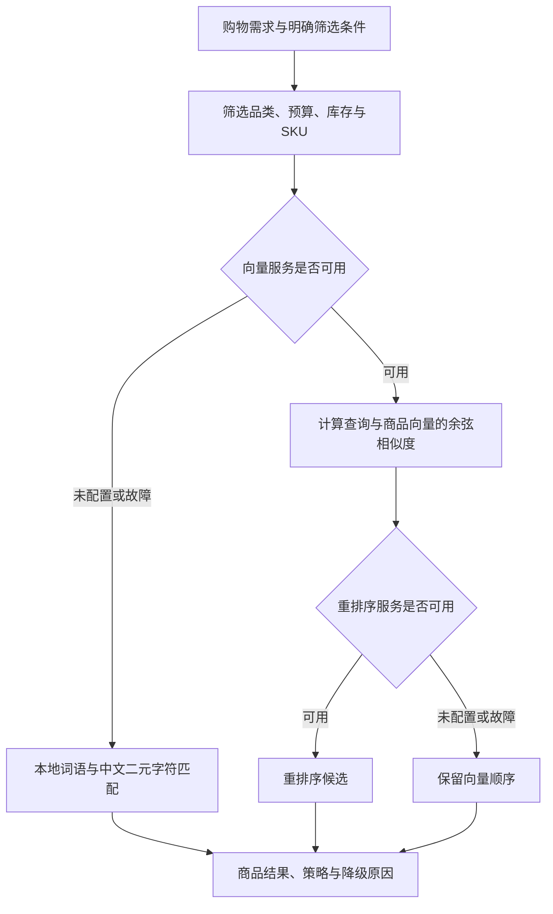

# 第 4 课：向量检索、重排序、RAG 与评测

本阶段为 Buyvora 增加可配置的向量召回和重排序、明确的故障降级、选购资料检索，以及一组可以重复执行的检索评测。当前没有真实向量服务配置，已验证的是数学计算、协议适配、业务约束和本地降级效果；真实服务质量尚待联调。

## 为什么关键词搜索还不够

原来的关键词接口要求每个关键词出现在商品文本里。“耳机”可以匹配；“通勤用的蓝牙耳机”作为整段文字就容易匹配失败。

增强检索有两条实际路径：



硬条件始终由 Python 业务代码执行。即使一个超预算商品向量分数最高，也不能挤掉预算内的候选。实现中以 SKU 为索引单位，具体颜色、价格与库存一起筛选。

## 四个概念分别做什么

**Embedding** 把文本转换成数字向量。我们调用兼容 `/embeddings` 的接口，再计算归一化向量的点积，也就是余弦相似度。接口返回的 `index` 用来匹配输入顺序，不能假设返回数组始终有序。[Embedding 接口说明](https://developers.openai.com/api/reference/python/resources/embeddings/methods/create)

**重排序** 再次比较查询与已召回候选。适配器请求 `/rerank`，使用返回的 `index` 与 `relevance_score` 对应原始候选。该协议形状参考了公开的重排序接口，使用其他平台时必须确认它支持相同结构。[重排序接口示例](https://jina.ai/news/how-to-build-article-recommendations-with-jina-reranker-api-only/)

**RAG** 先检索资料，再把资料作为依据交给模型回答。`knowledge/` 中有本项目编写的 5 份选购指南，按小节与长度切片，返回文件来源、段落 ID 和原文。Agent 的 `search_knowledge` 工具把这些内容交回模型，并提示在回复中引用真实段落 ID。RAG 不能保证模型完全不犯错，引用与商品事实仍需要验证。

**降级** 在外部服务不可用时，继续提供能力范围内的结果，并明确说明实际策略。当前降级算法按英文词和中文相邻双字计算加权重叠，不生成向量，不具有完整同义理解能力。

## 代码地图

| 文件 | 职责 |
| --- | --- |
| `app/retrieval/types.py` | 检索文档、分数、结果元数据与可替换接口 |
| `app/retrieval/providers.py` | 外部 embedding / rerank 的请求、校验和错误隔离 |
| `app/retrieval/engine.py` | 余弦扫描、候选截断、缓存、重排序与降级 |
| `app/services/catalog_retrieval.py` | 从符合硬条件的 SKU 构建商品结果 |
| `app/services/knowledge_service.py` | Markdown 切片与来源信息 |
| `app/retrieval/composition.py` | 为 API 和 Agent 装配同一套服务 |
| `eval/catalog-cases.json` | 独立标注的查询、条件和相关商品 |
| `scripts/eval_retrieval.py` | 对照基线计算指标并检查回归 |

当前商品目录很小，向量索引使用内存中的精确余弦扫描。文档向量按内容快照缓存 5 分钟，变化或过期后重建；并发首次请求共享一次建索引过程。查询向量按次生成。它不是数据库持久化索引，也没有声称具备大规模近似检索性能。

## 不配置模型也能练习

启动服务：

```powershell
uv run uvicorn app.main:app --reload
```

打开 http://127.0.0.1:8000/docs，在商品接口设置：

```text
q = 通勤用的蓝牙耳机
search_mode = semantic
category = headphones
max_price = 300
```

查看响应的 `retrieval`：未配置向量服务时会得到 `strategy: keyword_2gram` 和 `fallback_reason: embedding_not_configured`。`semantic` 是请求的检索模式，`strategy` 才是实际运行的方法。

不传 `search_mode` 时继续使用原有 `keyword` 规则。`sku_name=白色` 可以指定规格；仅在自然语言里写“白色”属于软相关性，不能代替这个硬条件字段。Agent 提示词会要求提取明确规格，但是否正确提取仍需真实模型评测。

知识接口：

```text
GET /commerce/knowledge?q=扩展坞 USB-C 接口&limit=2
```

返回的每个片段包含 `source`（例如 `knowledge/hubs.md`）、`id`（例如 `hubs:001`）、小节标题和原文。资料说明未知参数应进一步核实，不允许根据接口外形推断未提供的产品能力。

## 实际策略与分页

- `keyword`：原有的完整关键词匹配。
- `browse`：查询文本为空，浏览符合硬条件的商品。
- `vector`：真实 embedding 接口返回向量后做余弦排序。
- `vector_rerank`：向量候选经过真实重排序接口。
- `keyword_2gram`：本地降级词语匹配。

`candidate_count` 是进入排名前符合硬条件的 SKU 数，知识检索中则是片段数。`scores` 表示当前返回条目的相关度，不同策略之间的分数不能直接比较。

增强模式最多保留 `RETRIEVAL_TOP_N` 个 SKU 候选，再聚合成商品并分页。因此 `total` 是这批候选中的匹配商品数；若候选被截断，`truncated=true`。它不是完整目录的精确命中总量。关键词模式的 total 保持原有完整匹配语义。

## 配置真实检索服务

在已有 `.env` 中填入平台提供的配置，不要覆盖已有 Key：

```dotenv
EMBEDDING_BASE_URL=https://your-embedding-provider.example/v1
EMBEDDING_MODEL=your-embedding-model
EMBEDDING_API_KEY=your-embedding-key

RERANKER_BASE_URL=https://your-reranker-provider.example/v1
RERANKER_MODEL=your-reranker-model
RERANKER_API_KEY=your-reranker-key
```

以上是格式示例。Embedding 与重排序分别使用明确配置，不会自动把聊天模型 Key 发往另一个地址。重排序是可选能力，仅在向量召回成功时使用。本机兼容服务可以使用回环 HTTP 地址，具体规则与第 3 课相同。

其他参数：请求与检索阶段默认 15 秒上限、候选最多 30 个、余弦阈值 0.25。阈值需要根据真实模型和评测集调整，并不通用于所有模型。响应正文限制为 4 MB，embedding 分批最多 32 条、单文本最多 4000 字符、向量最多 8192 维。非法向量、重复索引、不完整重排序和服务错误都会触发可见降级。

## 评测结果怎样理解

运行不消耗模型额度的本地评测：

```powershell
uv run python scripts/eval_retrieval.py --check
```

结果默认写入被 Git 忽略的 `data/retrieval-eval.json`。本阶段保存的历史报告在 `eval/baseline-local.json`。

这组样本共 17 条：12 条有相关商品，5 条应当无结果。当前结果：

| 指标 | 原有关键词 | 本地降级检索 |
| --- | ---: | ---: |
| Recall@3 | 25% | 91.7% |
| MRR@3 | 0.25 | 0.875 |
| 无结果样本正确率 | 100% | 100% |
| 硬条件违规数 | 0 | 0 |

Recall@3 衡量前三个结果找回了多少标注的相关商品；MRR@3 更看重第一个相关商品靠不靠前。无结果样本单独计算，不能用大量空结果抬高召回率。

这些是**小型、自编、演示目录样本**上的结果，不是线上效果或通用语义理解指标。`semantic-challenge`（“地铁里隔绝噪声”）仍漏检，报告完整保留了它，不通过删除困难样本制造满分。

完成真实模型配置后：

```powershell
uv run python scripts/eval_retrieval.py --live --check
```

这会消耗所选平台额度。真实模式不仅检查质量阈值，还检查有答案样本实际用了向量路径；如果同时配置重排序，也必须实际运行重排序。这样不会在服务故障时靠本地降级误报真实联调成功。

GitHub Actions 会在每次提交后运行本地评测，不使用任何真实模型 Key。

## 你的练习

先在 `eval/catalog-cases.json` 增加一个你认为用户会问的需求，人工判断哪些商品应当匹配，再运行评测。若漏检，先判断原因：是数据没有写清、关键词表述不同、SKU 硬条件不满足，还是确实需要语义模型。

```powershell
git diff
uv run pytest -q
uv run python scripts/eval_retrieval.py --check
git add eval/catalog-cases.json
git diff --cached
git commit -m "test: add a shopping retrieval case"
git push
```

面试时可以解释：如何保证语义检索不绕过预算和库存？服务故障时怎样让降级可见？为什么要用标注样本测效果，而不只展示一次成功对话？
